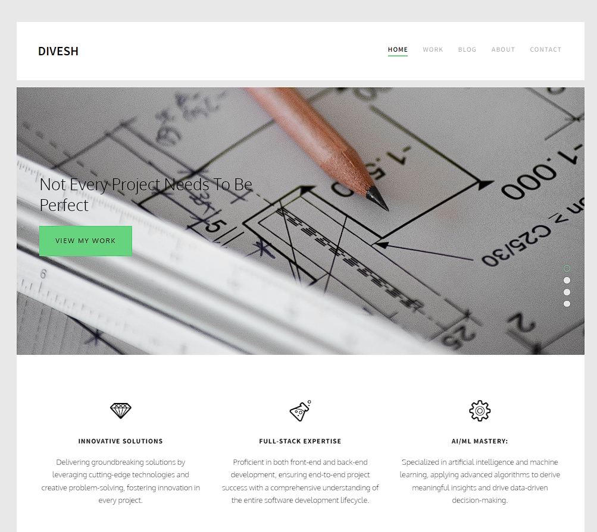

# Divesh Website

Welcome to the repository for my personal portfolio website. This website serves as a showcase of my skills, projects, and experience as a full-stack and AI/ML software developer.

## Live Demo

Visit the live website: [Your Portfolio Website](https://diveshwebsite.000webhostapp.com)

## Technologies Used

- HTML
- CSS
- SASS
- JavaScript

## Features

- **Project Showcase:** Explore details about my featured projects.
- **Resume:** Download my latest resume.
- **Contact Form:** Reach out to me directly through the website.

## Screenshots

## Installation

1. Clone the repository: `git clone https://github.com/your-username/your-portfolio.git`
2. Open `index.html` in your preferred web browser.

## Usage

Feel free to use this template for your own portfolio. Just update the content, add your projects, and personalize it to showcase your skills and achievements.

## License

This project is licensed under the [MIT License](LICENSE).

## Contact

- Email: your.email@example.com
- GitHub: [Your GitHub Profile](https://github.com/your-username)

## Acknowledgements

Special thanks to 000webhostapp.com.

If you have any questions or suggestions, feel free to reach out. Happy coding!
